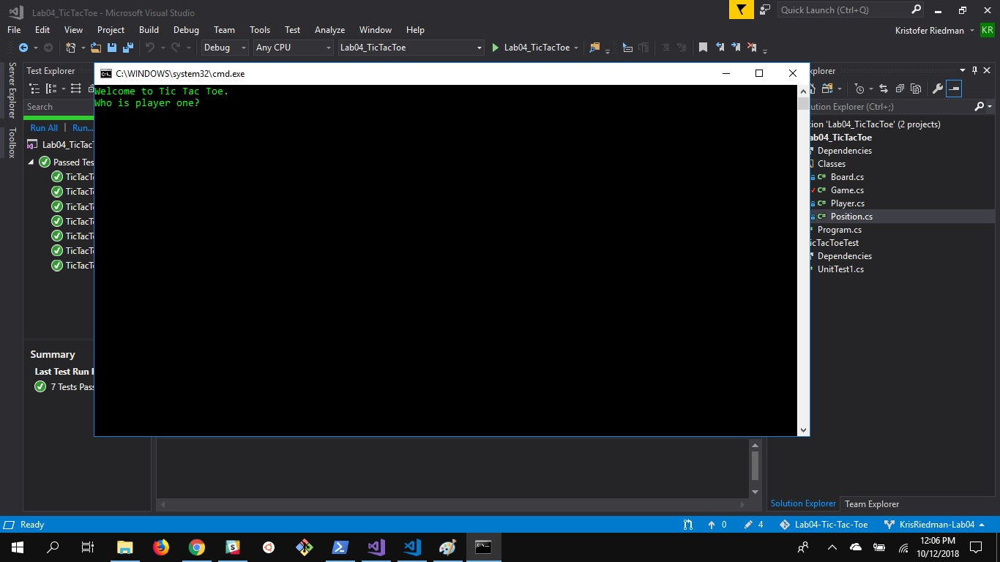
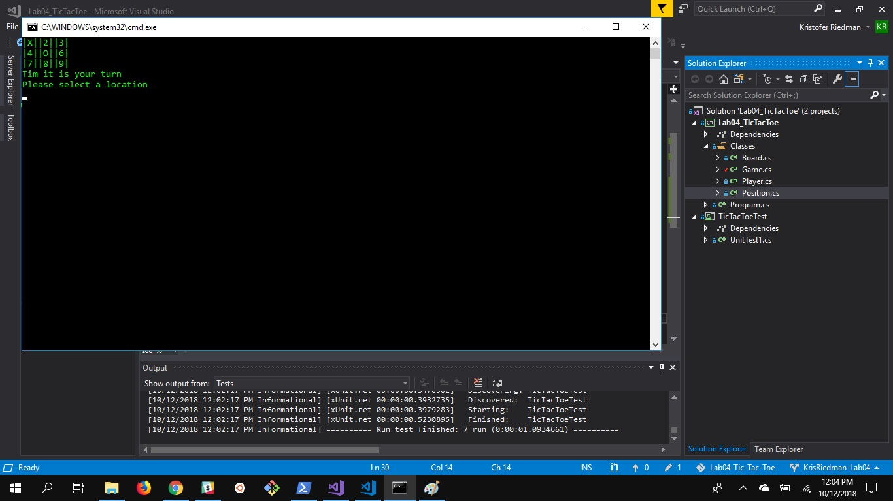
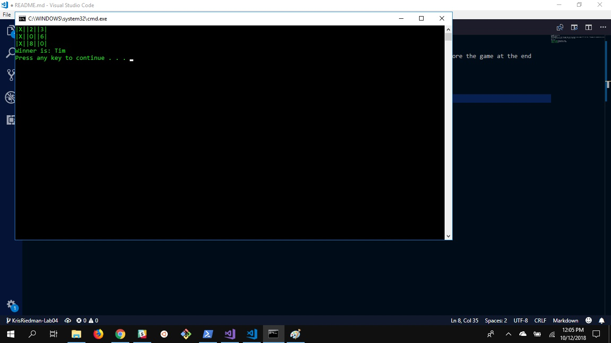

# Lab04-Tic-Tac-Toe
## Description
This program is a Tic Tac Toe game that lets two players play a game of Tic Tac Toe.  The game will automatically score the game at the end
and will declare a winner or a tie if that is the case.

## Directions
1. Start Visual Studio
2. Open Solution File
3. Select Run Without Debugging
4. Follow On Screen Prompts

## Visuals

